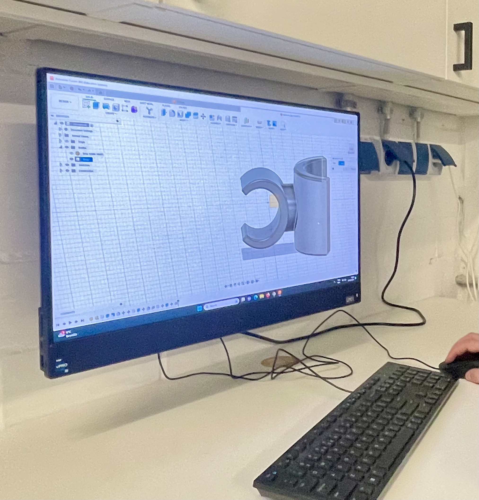

# 3D Print Exposure Mount Project

An extracurricular project at the fablab @42Berlin.

With thanks to Luiz Baron for creating the model on [Autodesk Fusion 360](https://www.autodesk.eu/products/fusion-360/overview)!

I had lost the mount for my rear exposure light. It is difficult if not impossible to buy just the mount for the saddle post. Instead of purchasing a new light, which can be quite pricey and typically retails between 50 and 70 Euros, I opted to 3D print the mount myself.

This repository contains the necessary files for 3D printing a mount designed for the "TraceR MK3 DayBright Rear" bike lights.

Here we start with a couple of parts:  

which will be joined:  

and printed:  

This part is supposed to be used with a strap. I thought it is safer than a rubber band. The material used for the 3D print will also influence its longevity!
